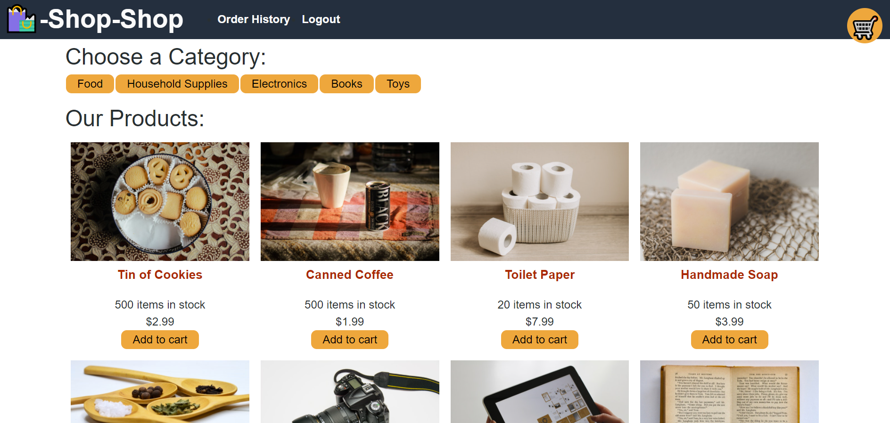

# Shop-Shop

## Table of Contents
* [Description](#description)
* [Installation](#installation)
* [Usage](#usage)
* [Contributing](#contributing)
* [Tests](#tests)
* [License](#license)
* [Questions](#questions)

## Description <a name="description"></a>
This is an e-commerce site that utilizes Redux for global state management in a React application.  The starter code that was provided was a fully functional application with a React front end and a Mongoose/MondoDB backend that utilized Context API for global state management.  The intent of this exercise was to refactor the code and utilize Redux for the global state management.  Refactoring tasks included creating a reducers.js file to include the initial state if one does not originally exist, creating a store.js file to initiate the store, updating App.js to utilize <Provider> from react-redux, and revise all component and page files to utilize the Redux functionality.

## Installation <a name="installation"></a>
To edit/improve/run the code of the application, please do the following: 

1. Clone the application's respository from GitHub onto your local drive.  The GitHub URL is: https://github.com/plainjane99/shop-shop.

2. Set up the ```npm``` package by running the following command in the root directory, the client directory, and the server directory of the application: 
    
    ```
    npm install
    ```
    
    This will download the application's dependencies into the respective directories.
3. A ```.gitignore``` file should be created to include:
    ```
    node_modules
    .env
    .DS_Store
    ```
    if you intend to push your code to a repository.

## Usage <a name="usage"></a>

1. a.  Once code installation is complete, run the application by typing the following into the command line at the root directory of the application:

    ```
    npm start
    ```
    
    The server will start and open your browser to the application page at http://localhost:3000/.    

1. b. The live version of the application is located at:  https://lit-tundra-62785.herokuapp.com/

2. The application should look like the following:



Functionality includes sign-up, log-in, adding items to your cart, offline functionality, and logging out.    

## Contributing <a name="contributing"></a>
Contributions are welcome.  

Please contact me regarding other improvements, questions, or comments you would like to make.

## Tests <a name="tests"></a>
This application uses Jest for testing of functionality.  Please see ```client/src/__tests__``` for existing tests.

## License <a name="license"></a>
This application is covered under the MIT license.

## Questions <a name="questions"></a>
My GitHub username is ```plainjane99```.  Please feel free to peruse my other projects.

If you have any questions regarding this application, please contact me via email at ```jane99hsu@gmail.com```.
  